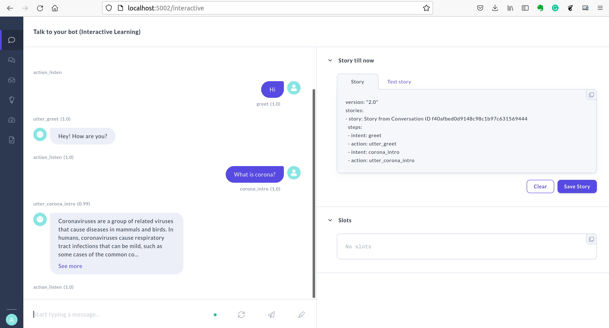

# Project: University Student Admission Prediction
> The goal of this project is to predict the admission of a student in an University.

> Dataset: https://www.kaggle.com/adityadeshpande23/admissionpredictioncsv

## Table of Contents
* [General Information](#general-information)
* [Problem Staement](#problem-statement)
* [Technologies Used](#technologies-used)
* [Setup](#setup)
* [Deployment](#usage)
* [Project Status](#project-status)
* [Room for Improvement](#room-for-improvement)
* [Contact](#contact)
<!-- * [License](#license) -->

## General Information
The goal of this project is to build, implement and deploy a python chatbot using Rasa (https://rasa.com/).

A chatbot is an application that can initiate and continue a conversation using auditory and/or textual methods as a human would do.
A chatbot can be either a simple rule-based engine or an intelligent application leveraging Natural Language Understanding. 
Many organizations today have started using chatbots extensively. Chatbots are becoming famous as they are available 24x7, 
provide a consistent customer experience, can handle several customers at a time, are cost-effective and hence, results in a 
better overall customer experience.

A chatbot can be used for the following purposes: 
- Customer support
- Frequently Asked Questions
- Addressing Grievances
- Appointment Booking
- Automation of routine tasks
- Address a query

## Problem Statement
The goal here is to build a chatbot which can answer basic queries related to the COVID-19 disease.

## Technologies Used
- Python 3.8.12
- Rasa 2.8.25
- Rasa SDK 2.8.4
- Rasa x 1.0.1

## Setup
All requirements are available on requirements.txt.

To install the requirements.txt file in your environment:
1. cd to the directory where requirements.txt is located.
2. activate your virtualenv.
3. run the command "pip install -r requirements.txt".

To deploy the chatbot on Rasa:
1. Download rasa: pip install rasa==2.8.25.
2. If you want to create a new rasa project: rasa init.
3. If you want to train the current project: rasa train. 
4. To check out the chatbot on the command line: rasa shell.
5. After the training and checking is completed: rasa x.
6. Download Rasa x (https://rasa.com/docs/rasa-x/): pip install rasa-x --extra-index-url https://pypi.rasa.com/simpl.
7. You will be able to check the chatbot in the web browser: rasa x

## Deployment
Project deployed on Rasa x (https://rasa.com/docs/rasa-x/)

## Project Status
Project is: _complete_ 

## Room for Improvement
The deployment can be done in other Cloud services like Telegram, WattsApp, Google Cloud, AWS, etc.

## Contact
Created by [Xavier Nuel Gavaldà](xaviernuelgav@gmail.com) - feel free to contact me!

<!-- Optional -->
<!-- ## License -->
<!-- This project is open source and available under the [... License](). -->

<!-- You don't have to include all sections - just the one's relevant to your project -->
